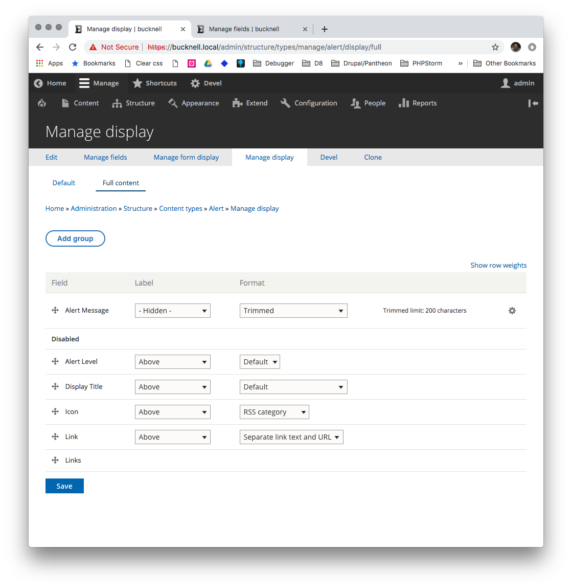
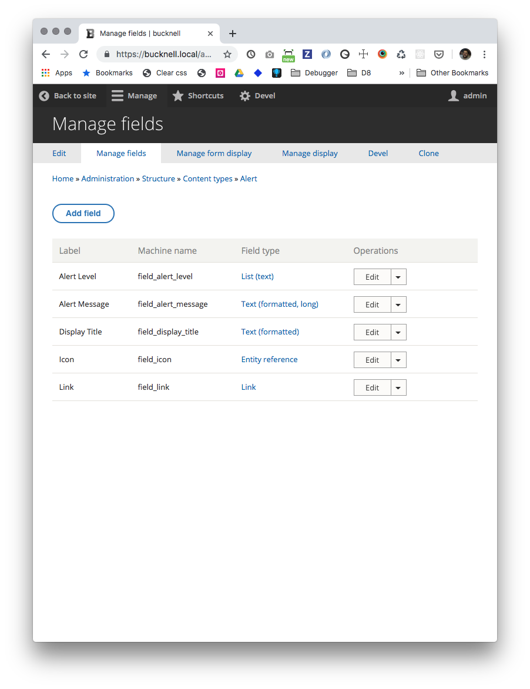
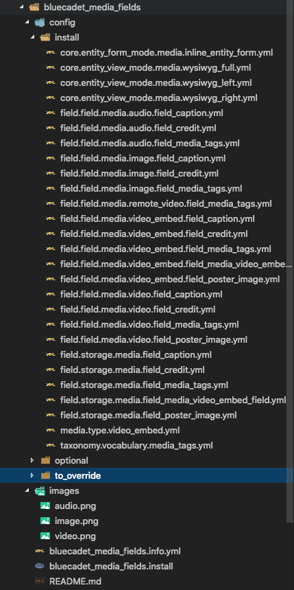
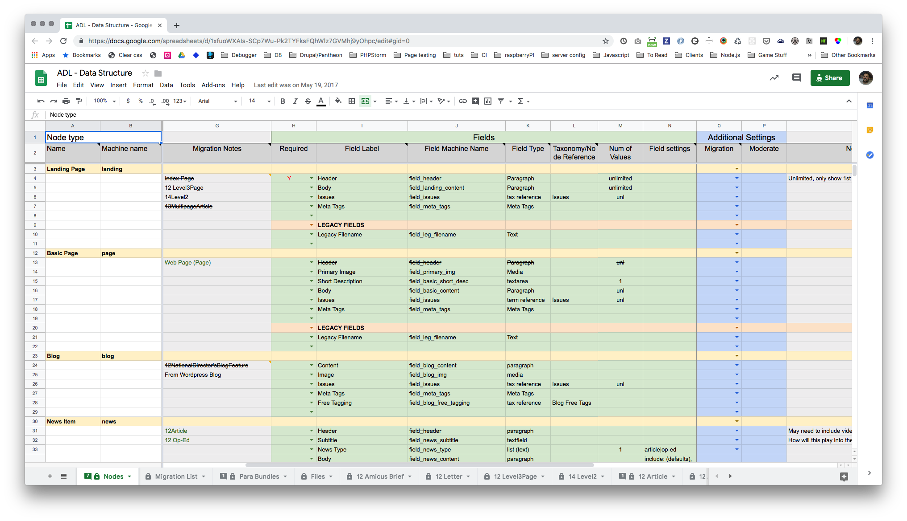

autoscale: true
build-lists: true
slidenumbers: true
footer: Pete Inge | Bluecadet | 5 min sites

# Five Minute Drupal Site

## Speading up our Drupal Dev Time

^ * Be the Story Teller
* Breathe

^ https://docs.google.com/spreadsheets/d/1CfIxF36UdHPrtDpy2dNWI5DxJFs7kdmRAwyq0Ly8D7Y/edit#gid=0
^ https://importer.local/admin/config/content/bc-aicc/content
^ https://importer.local/admin/config/content/entity_browser
^ https://importer.local/admin/structure/media/manage/image/fields
^ https://importer.local/admin/structure/types
^ https://importer.local/admin/structure/taxonomy
^ https://importer.local/admin/structure/paragraphs_type

---

# Who am I?

## Pete Inge
###Senior Developer, Bluecadet

pinge@bluecadet.com
https://github.com/pingevt/five-min-site


^ Experience: ~10yrs freelance in web dev
Worked in D5-D8
Current: @ BC for 3.5 years
I'm a problem solver
Contact for more info

---

#Bluecadet


^ Established in 2007, Bluecadet is an Emmy Award-winning digital agency that creates world-class websites, mobile apps, interactive installations, and immersive environments. We collaborate with leading museums, cultural institutions, universities, progressive brands, and nonprofit organizations to educate, engage, and entertain.

^ Bluecadet is an experience design agency. We partner with mission-driven organizations to create a broad suite of products and environments. We embrace design, technology, and innovation in the service of content, emotion, and experience. We create experiences that engage audiences through increased knowledge, empathy, and action.

^ We don't consider ourselves a Drupal shop. We do want to use the right tool for the right job. That said, we do use Drupal, and the "other" CMS for most of our BE needs. We are slated this year to really epxplore other CMSs, but my gut is telling our websites will stay inthe Drupal sphere for quite awhile.

---

# Who is this for?

- “Site Builders”
- Moderate to Advanced Coders
- Anyone interested in speeding up their process

---

# What we’ll cover

- Bluecadet's process of how we handle building our Drupal sites
  - From frustrations to some solutions
- How Drupal works in order for us to tinker with it
- Specifically talking about new site builds
- Hopefully, a lot of discussion/Q&A

^ I'll be honest here, part of why I wanted to give this talk was to have a discussion and hear from you.

---

# How does Drupal actually work?

1. Theres code and logic and functions and methods doing all this work we see in the admin
2. Drupal 8 is saving configuration to yaml files

^ Let's start here, and ask ourselves...?

^ 2 key principels as we can tinker with Drupal

^ Let's take a closer look at these...

---

## Code and functions and more (ex.)




``` php
...
$msg = $media->field_alert_message->view([
  'label' => 'hidden',
  'type' => 'text_trimmed',
  'settings' => [
    'trim_length' => '200',
  ],
]);
...
```

^ A big thing we use code for is display different size images based on preselected fields

---

## YAML config files

``` yaml
...

id: node.alert.full
targetEntityType: node
bundle: alert
mode: full
content:
  field_alert_message:
    type: text_trimmed
    weight: 0
    region: content
    label: hidden
    settings:
      trim_length: 200
    third_party_settings: {  }
hidden:
  field_alert_level: true
  field_display_title: true
  field_icon: true
  field_link: true
  links: true
```

^ We are coders/developers. We can do this! Drpal being open source we can get into the nuts and bolts of it to bend Drupal to our will!

---

## Code and functions and more (ex.)

``` php
$content_type = NodeType::create([
  'type' => $entity_defaults['bundle'],
  'name' => $entity_defaults['name'],
  'description' => $entity_defaults['description'],
  'title_label' => $entity_defaults['title_label'],
  'preview_mode' => $entity_defaults['preview_mode'],
  'help' => $entity_defaults['help'],
  'new_revision' => $entity_defaults['new_revision'],
  'display_submitted' => $entity_defaults['display_submitted'],
]);
```

---

## Code and functions and more (ex.)

``` php
// Menu.
$menus = explode(",", $entity_defaults['available_menus']);
$content_type->setThirdPartySetting('menu_ui', 'available_menus', $menus);
$content_type->setThirdPartySetting('menu_ui', 'parent', $entity_defaults['parent']);

$content_type->isNew();
$content_type->save();

$fields = \Drupal::service('entity_field.manager')->getFieldDefinitions('node', $entity_defaults['bundle']);
$fields['status']->getConfig($entity_defaults['bundle'])
  ->setDefaultValue($entity_defaults['status'])
  ->save();

$fields['promote']->getConfig($entity_defaults['bundle'])
  ->setDefaultValue($entity_defaults['promote'])
  ->save();

$fields['sticky']->getConfig($entity_defaults['bundle'])
  ->setDefaultValue($entity_defaults['sticky'])
  ->save();
```

^ Here, I'm creating a content type.

---

# What is the problem?
## Why do we want to speed things up?


- Development (site building) takes FOREVER
- Specifically clicking through the admin
- Revisions to CTs and fields
- TIME == MONEY

^ Use THF for revisions examples

^ --Phase 1 = 18 CTs, 9 paragraph bundles, 5 taxonomies, ~300 Fields (some minor re-use)

^ How many clicks to setup a single CT and plain text field [~2.5 mins, 13 clicks (page/ajaxing)]

^ --THF example: roughly 700 mins / > 11 hours, if all goes well and I don't get board... (After planning it out)

^ We typically set things up very similiar on each site. (Entity, more specifically Media Browsers)

^ --How many people use media browsers?

---

# What do we have out there already?

- Installation Profiles
- Distributions
- Config
- D7 we had Features module (Config-split)

^ What else is really out there?

---

# What do we have out there already?

## Installation Profiles

> Installation profiles provide site features and functions for a specific type of site as a single download containing Drupal core, contributed modules, themes, and pre-defined configuration. They make it possible to quickly set up a complex, use-specific site in fewer steps than if installing and configuring elements individually. For example, an installation profile for conferences might include modules for advanced user registration, attendee profiles, ticketing, and a list of speakers and sessions. Once installed, installation profiles can be configured and customized the same as traditionally-built Drupal sites. Refer to the installation profile documentation for more information.

^ If Install Profiles and Distributions works for you, GREAT! Use it!

---

# What do we have out there already?

## Distributions

> Distributions are full copies of Drupal that include Drupal Core, along with additional software such as themes, modules, libraries, and installation profiles. There are two main types of Drupal distributions:

- Full-featured distributions: complete solutions for specialized use cases.
- Other distributions: quick-start tools, starting points for developers and site builders.

^ Distributions works for you, GREAT! Use it!

---

# What do we want?

- React Admin theme
- drupal.org/about/strategic-initiatives/admin-ui-js

^ Everytime I think about this... I just really want a react admin layer ontop of it all.

^ Code Monkeys!

---

# What we are doing:

- Snippets & internal documentation.
- “Config modules” (think Features Modules from d7)
- the Importer

^ At BC, what are we doing?

---

# Snippets & Internal Documentation

- We **try** to fully document what we do for each project
- Make that documentation available to our teams in an easy way
  - Github wiki | Docpress (within github) | Fractal docs
- Make it as copy/paste friendly as possible
- We **try** build this into our workflow (Just do it)

^ This happens slowly while working on projects but we also schedule in time to specifically work on this. For example, on Fridays after lunch we have a large sprint planning meeting for the coming week. Once that is done, we set aside time to work on our group projects to improve this documentation.

---

# Snippet Example

``` bash
drush en admin_toolbar admin_toolbar_tools
config_devel config_split ctools devel kint
diff focal_point hsts inline_entity_form
new_relic_rpm pantheon_advanced_page_cache
paragraphs
```

---

# Config Modules
## What do I mean by this?

- We constantly do certain things over and over for every project
- Or at least a base...

^ Closely realated to Feature modules in D7

^ Will get into specifics later...

---

# Config Modules
## How do they work?

- Install module
  - Config is imported
  - HOOK_install() is run
- Uninstall module
- Discard module

---

# Config Modules: Alerts



- Content Type with set number of fields
- View to display Alerts
- 8 config files

^ Very similiar to a features module from d7

^ Can use copy/paste drush commands to install and uninstall these modules

^ Tweak later

---

# Config Modules: Media

- Always have caption and credit fields on our Media Entities
- Add a Media Taxonomy
- We always use the same Media/Entity Browsers



---

# Config Modules: Media

## Custom Code that can't be in config

``` php

function bluecadet_media_fields_install() {
  ...

  $eb_configs['image_browser'] = [
      'config' => [
        'name' => 'image_browser',
        'label' => 'Image Browser',
        'display' => 'modal',
        'display_configuration' => [
          'width' => '',
          'height' => '',
          'link_text' => 'Select images',
          'auto_open' => FALSE,
        ],
        'selection_display' => 'no_display',
        'selection_display_configuration' => [],
        'widget_selector' => 'tabs',
        'widget_selector_configuration' => [],
      ],
  ...
```

---

# Config Modules: Media

## Custom Code that can't be in config

```php
function bluecadet_media_fields_install() {
...

  foreach ($eb_configs as $eb_config) {

      $eb = EntityBrowser::load($eb_config['config']['name']);

      if(!$eb) {
        $eb = EntityBrowser::create($eb_config['config']);
        $eb->save();
        drupal_set_message(t('Added Entity Browser: %eb', ['%eb' => $eb_config['config']['label']]));
        foreach ($eb_config['widgets'] as $w) {
          $eb->addWidget($w);
          $eb->save();
        }
      }
      else {
        drupal_set_message(t('Entity Browser: %eb already exists', ['%eb' => $eb_config['config']['label']]));
      }
    }

  ...

  }
```

^ Here, I've previously set up a config array to build multi-ple entity browsers.

---

# Config Modules
## Recap

- Install module
  - Config is imported
  - HOOK_install() is run
- Uninstall module
- Discard module

---

# the Importer

^ My baby for the past few months... still slightly hesitant about it and where its going. But this is a project I put a lot of time and effort into and hopefully not just a helpfull excercise.

^ Let's jump into it.

---

# the Importer

- We originally had a google spreadsheet to plan with labels and machine names

---



^ Helped us plan for larger sites before actually clicking through the site

---

# the Importer

- We originally had a google spreadsheet to plan with labels and machine names
- We have a "typical way of doing it", think "defaults" for Form and Display Formatters
- We also incurred a lot of technical debt
- We *should* be able to automate this

^ History: What do I mean by this?

^ Drupal defaults aren't always our defaults

^ What happened??

^ ... b/c re-factoring was time intensive. THF - one field might have 3 different "names"

^ These were all weighing on my mind last fall.

---

# the Importer

- Started with "basic" proof of concept
  - Content Type, Tax Terms and Paragraphs
  - Plain Text Fields
  - Entity Reference (Revisions) Fields (if we couldn't do this, its useless)

---

## It WORKED!!

---


^ relate back to earlier... How Drupal Works...

^ .csv -> structured data -> drupal code...

---

# the Importer

- Added More
  - Field Groups
  - Updating field groups ordering
  - Minor validation on the spreadsheet
  - As many fielde types as we needed for our typical projects
     - the list kept growing...

---

# the Importer && Config Module

##DEMO TIME

(build | test | destroy)

---

# the Importer

### Point & Click vs. CLI

Drupal's BE is just a layer on top of code. Some Examples:

- Pantheon/Terminus
- Drupal/Drush

---

# the Importer

## The future...

- Importer updates
- More validation / error checking
- Automation
- CI ??
- Composer ??
- Release into the wild ??

---

# What's the benefit?

- Saving some time ($$)
- Skipping the mundane part of Drupal
- Standardizing fields/machine names, etc.
- Easily iterate

^ for all of these tools...

^ how much time can we save? Config modules, small amount. Importer, larger amount.

^ Move on to the more fun parts of Drupal quicker.

^ explain standard field names, etc.

^ Iteration

---

#Thanks!

###Questions?<br><br>Comments?<br><br>Discussion?

---

#Bluecadet


---
